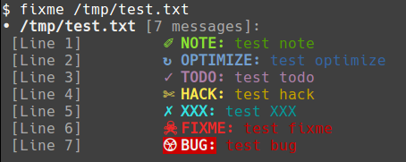

# fixme

[](https://github.com/jakewarren/fixme/releases])
[](https://github.com/jakewarren/fixme/blob/master/LICENSE)
[](https://goreportcard.com/report/github.com/jakewarren/fixme)

> Scan for NOTE, OPTIMIZE, TODO, HACK, XXX, FIXME, and BUG comments within your source, and print them to stdout so you can deal with them.



## Table of Contents

- [Background](#background)
- [Install](#install)
- [Usage](#usage)
- [Maintainers](#maintainers)
- [Contribute](#contribute)
- [License](#license)

## Background

Very heavily inspired by https://github.com/JohnPostlethwait/fixme.

## Install

### Option 1: Binary

Download the latest release from [https://github.com/jakewarren/fixme/releases](https://github.com/jakewarren/fixme/releases)

### Option 2: From source

```
go get github.com/jakewarren/fixme
```

## Usage

```
❯ fixme -h
usage: fixme [<flags>] <file>

Searches for comment tags in code

Optional flags:
  -h, --help                    Show context-sensitive help (also try --help-long and --help-man).
      --skip-hidden             skip hidden folders (default=true)
  -i, --ignore-dir=vendor ...   pattern of directories to ignore
      --ignore-exts=.txt ...    pattern of file extensions to ignore
      --line-length-limit=1000  number of max characters in a line
  -l, --log-level=error         log level (debug|info|error)
  -V, --version                 Show application version.

Args:
  <file>  the file or directory to scan

```

## Maintainers

[@jakewarren](https://github.com/jakewarren)

## Contribute

PRs accepted.

## License

MIT © 2017 Jake Warren
